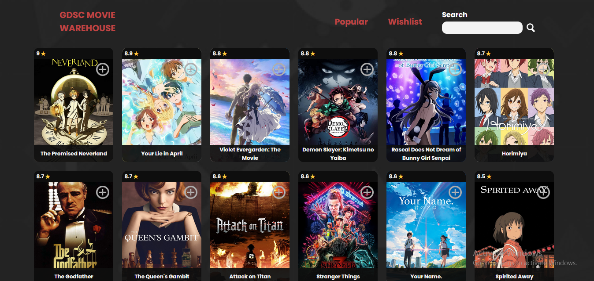
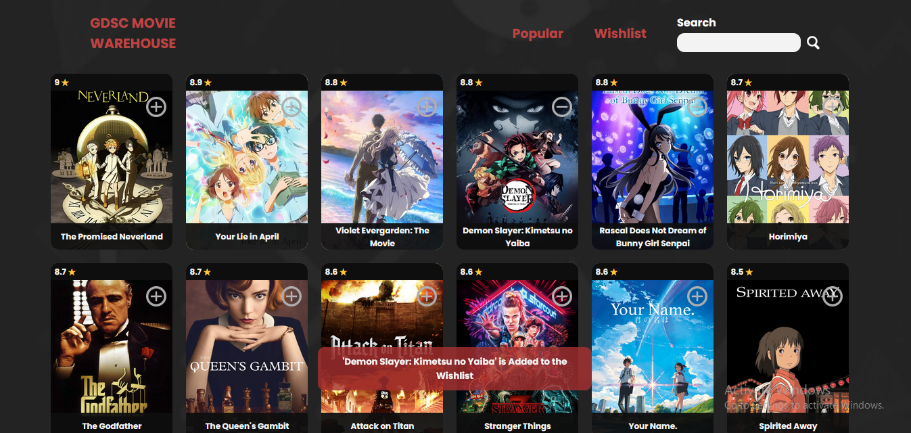
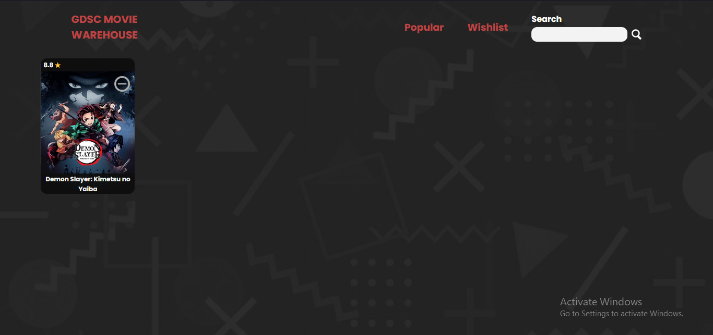
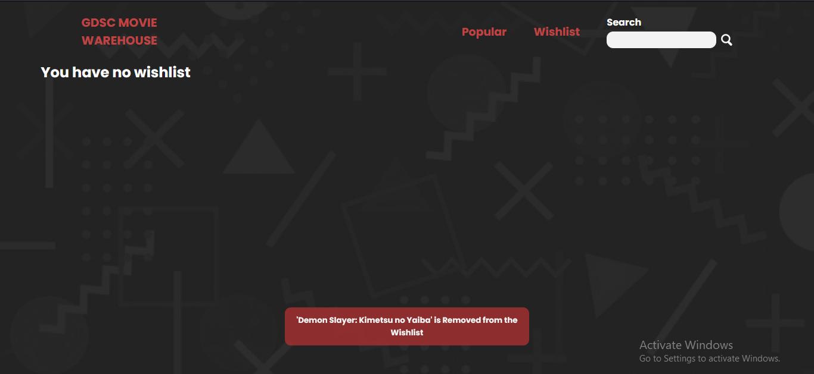

# React Movie Warehouse
**Hello Everyone** 🐸👋This is the continuation of GDSC-moviewarehouse i made previously, bulit with React.js. There are total changes, especially on its main functionality, as this website is more focused on wishlist feature.

Here is a first look at my website. The movies shown is my picked and saved list that is fetched from **The Movie Database (TMDB)** — The movie list is fetched. 

As explained before, the main feature in this version is to add a movie to **wishlist**. Adding movies can be done by clicking the plus button embedded in the top right of every movies. On adding, the pop up will shown at the bottom of the website as a notice that the movie has been added to the wishlist. The movie can be removed from the wishlist immediately by clicking the minus button (that previously was a plus button) on the top right of the movie poster.

After, the movies you added before will be shown in the wishlist page. You can also remove it from the wishlist with the same step as before.

On remove, the pop up will appear again to sign the user that the movie has been removed from the wishlist. When there is no wishlist, the page will appear like what shown above.

So that's sum up the core features of this website. 
Thanks for actually reading this. Have a nice day  
Hope we meet again in future occasion 😎. But for now, i guess **Goodbye** 🐸👋
